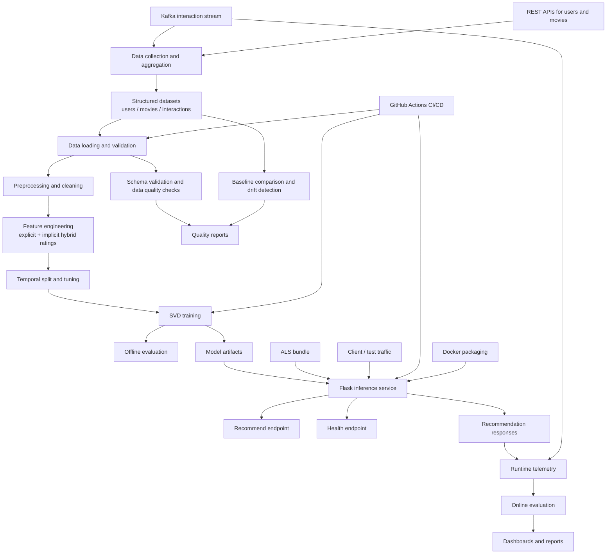

# AI Movie Recommendation System

An end-to-end movie recommendation system built for a streaming platform scenario. The project covers the full machine learning lifecycle: data collection, preprocessing, feature engineering, model training, offline evaluation, online monitoring, inference serving, testing, containerization, and CI/CD.

This repository was developed as part of Carnegie Mellon University's Machine Learning in Production course by team `Pulp Predictions`.

## Executive Summary

This project demonstrates how to take a recommender system beyond a modeling notebook and turn it into a more complete ML product. Instead of stopping at offline experimentation, the repository includes:

- a modular training pipeline
- hybrid explicit + implicit feedback modeling
- temporal evaluation to reduce leakage
- a containerized inference API
- fallback behavior for serving robustness
- data quality and drift monitoring
- online telemetry analysis
- automated tests and CI/CD

From a portfolio perspective, the strongest part of this repository is that it shows both **machine learning depth** and **production engineering discipline**.

## Why This Project Stands Out

- It solves a realistic recommendation problem rather than a toy classification task.
- It uses both offline and online evaluation ideas, not just train/test accuracy.
- It includes MLOps components such as testing, Docker, CI/CD, monitoring, and artifact handling.
- It shows awareness of production concerns like cold start, drift, latency, coverage, and fallback behavior.
- It is organized into reusable Python modules instead of keeping the workflow inside notebooks only.

## Problem Statement

Streaming platforms need to help users discover movies they are likely to watch or rate highly. That becomes difficult when:

- the catalog is large
- users generate massive volumes of interaction data
- only a subset of users provide explicit ratings
- recommendations must be served quickly in production
- the system needs monitoring, testing, and deployment support beyond model training

This project addresses that problem by building a recommendation pipeline that learns from both explicit ratings and implicit watch behavior, then serves recommendations through a production-style API with evaluation and monitoring support.

## Scope and Dataset Context

The project is built around a large-scale streaming-style recommendation setting, with course infrastructure and prior project documentation centered on:

- roughly `145K+` users
- roughly `27K+` movies
- roughly `2.5M+` aggregated user-movie interactions

The raw watch logs arrive at much higher event volume and are aggregated into cleaner user-item interactions for downstream modeling.

## What This Project Does

The system is designed to:

- collect user, movie, and interaction data from course infrastructure
- transform raw watch-time logs into usable recommendation features
- generate hybrid ratings from explicit ratings plus implicit watch behavior
- train collaborative filtering recommenders
- evaluate model quality with temporal splits to reduce leakage
- serve recommendations through a Flask API
- fall back to a secondary model when the primary recommender is unavailable
- monitor data quality, drift, and online behavior
- support testing, Docker packaging, and GitHub Actions automation

## Technical Stack

- `Python`
- `Pandas`, `NumPy`, `SciPy`
- `scikit-learn`
- `Flask`
- `Kafka`
- `pytest`, `pytest-cov`
- `Docker`
- `GitHub Actions`

## Architecture Overview

```text
                                     +----------------------+
                                     |   REST API Sources   |
                                     | users + movie meta   |
                                     +----------+-----------+
                                                |
                                                |
+----------------------+              +---------v----------+
|     Kafka Stream     |------------->| Data Collection /  |
| watch / rating logs  |              | Event Aggregation  |
+----------+-----------+              +---------+----------+
           |                                     |
           |                                     v
           |                          +----------+-----------+
           |                          |   Structured Data    |
           |                          | users / movies /     |
           |                          | interactions tables  |
           |                          +----------+-----------+
           |                                     |
           |                                     v
           |                          +----------+-----------+
           |                          | Data Loading +       |
           |                          | Validation           |
           |                          +----------+-----------+
           |                                     |
           |                                     v
           |                          +----------+-----------+
           |                          | Data Preprocessing   |
           |                          | cleaning + filtering |
           |                          +----------+-----------+
           |                                     |
           |                                     v
           |                          +----------+-----------+
           |                          | Feature Engineering  |
           |                          | hybrid ratings       |
           |                          +----------+-----------+
           |                                     |
           |                                     v
           |                          +----------+-----------+
           |                          | Temporal Splits +    |
           |                          | Hyperparameter Tuning|
           |                          +----------+-----------+
           |                                     |
           |                                     v
           |                          +----------+-----------+
           |                          |  SVD Model Training  |
           |                          |  primary model       |
           |                          +----------+-----------+
           |                                     |
           |                                     +--------------------+
           |                                     |                    |
           |                                     v                    v
           |                          +----------+-----------+   +----+----------------+
           |                          | Offline Evaluation   |   | Data Quality +      |
           |                          | RMSE / Recall /      |   | Drift Monitoring    |
           |                          | NDCG / coverage      |   +----+----------------+
           |                          +----------+-----------+        |
           |                                     |                    |
           |                                     +---------+----------+
           |                                               |
           |                                               v
           |                                   +-----------+-----------+
           |                                   | Saved Artifacts       |
           |                                   | models / reports      |
           |                                   +-----------+-----------+
           |                                               |
           |                                               v
           |                                   +-----------+-----------+
           |                                   | Flask Inference API   |
           |                                   | /recommend /health    |
           |                                   +-----+-----------+-----+
           |                                         |           |
           |                           primary path  |           | fallback path
           |                                         v           v
           |                                  +------+--+   +----+--------+
           |                                  |  SVD    |   | ALS fallback |
           |                                  | model   |   | recommender  |
           |                                  +---------+   +-------------+
           |                                         |
           |                                         v
           |                                  +------+------+
           +--------------------------------->| Clients /   |
                                              | load tests  |
                                              +------+------+
                                                     |
                                                     v
                                              +------+------+
                                              | Telemetry /  |
                                              | Online Eval  |
                                              +------+------+
                                                     |
                                                     v
                                              +------+------+
                                              | Dashboard /  |
                                              | Reports      |
                                              +-------------+
```

### Architecture Diagram



## End-to-End System

### 1. Data Collection

The raw data comes from two sources:

- Kafka event streams for user watch activity
- REST API endpoints for user and movie metadata

The repository includes:

- [`data_collection.ipynb`](/c:/Personal/Aravinda%20Stuff/CMU/3rd%20semester/Machine%20Learning%20in%20Production/AI-Movie-Recommendation-System/data_collection.ipynb)
- [`movie_recommendation_system/data_collection_refactored.py`](/c:/Personal/Aravinda%20Stuff/CMU/3rd%20semester/Machine%20Learning%20in%20Production/AI-Movie-Recommendation-System/movie_recommendation_system/data_collection_refactored.py)

The collection workflow aggregates minute-level events into user-movie interactions such as total watch time, which is later used as implicit feedback.

### 2. Data Loading and Validation

The offline pipeline loads three core datasets:

- users
- movies
- interactions

[`movie_recommendation_system/data_loader.py`](/c:/Personal/Aravinda%20Stuff/CMU/3rd%20semester/Machine%20Learning%20in%20Production/AI-Movie-Recommendation-System/movie_recommendation_system/data_loader.py) performs:

- CSV loading with multiple encoding fallbacks
- required-column validation
- empty-dataset checks
- basic datatype validation

### 3. Data Preprocessing

[`movie_recommendation_system/data_preprocessor.py`](/c:/Personal/Aravinda%20Stuff/CMU/3rd%20semester/Machine%20Learning%20in%20Production/AI-Movie-Recommendation-System/movie_recommendation_system/data_preprocessor.py) cleans and filters the data by:

- removing duplicates
- filtering invalid user ages and gender values
- cleaning malformed movie identifiers and missing titles
- dropping invalid interactions
- capping extreme watch times
- parsing timestamps for temporal evaluation
- keeping only consistent users and movies across datasets
- enforcing minimum interaction thresholds

### 4. Feature Engineering

[`movie_recommendation_system/feature_engineer.py`](/c:/Personal/Aravinda%20Stuff/CMU/3rd%20semester/Machine%20Learning%20in%20Production/AI-Movie-Recommendation-System/movie_recommendation_system/feature_engineer.py) creates the main training signal used by the production model.

The key idea is a **hybrid rating**:

- if an explicit user rating exists, use it
- otherwise convert watch time into an implicit rating using percentiles

It also computes user-level and movie-level aggregate features, then prepares a lean training set centered on:

- `user_id`
- `movie_id`
- `final_rating`

### 5. Model Training

The repo includes two recommendation approaches:

- **SVD / matrix factorization** as the primary production model
- **ALS** as a fallback recommender in the inference service

#### Primary model: SVD

[`movie_recommendation_system/svd_model_trainer.py`](/c:/Personal/Aravinda%20Stuff/CMU/3rd%20semester/Machine%20Learning%20in%20Production/AI-Movie-Recommendation-System/movie_recommendation_system/svd_model_trainer.py) trains a `TruncatedSVD`-based recommender on the user-item matrix built from hybrid ratings.

Notable training behavior:

- builds sparse user-item matrices
- supports temporal train/test splitting
- supports temporal train/validation/test splitting
- performs hyperparameter search over `n_components`
- stores user and item factors for fast inference
- falls back to popular-item recommendations for unseen users

#### Fallback model: ALS

The inference layer can load an ALS bundle and use it when SVD recommendations are unavailable.

### Model Selection Rationale

The repository compares multiple collaborative filtering approaches and uses SVD as the primary served model because the project favors a balance of:

- recommendation quality
- compact model size
- fast inference
- deployability in a lightweight API service

ALS remains useful as a backup path in the serving layer so the system can degrade gracefully instead of failing hard.

### 6. Offline Evaluation

[`movie_recommendation_system/model_evaluator.py`](/c:/Personal/Aravinda%20Stuff/CMU/3rd%20semester/Machine%20Learning%20in%20Production/AI-Movie-Recommendation-System/movie_recommendation_system/model_evaluator.py) evaluates the model beyond simple accuracy.

Implemented evaluation areas include:

- temporal validation to reduce data leakage
- RMSE and MAE
- precision@k, recall@k, and NDCG@k
- popularity-baseline comparison
- cold-start analysis
- subpopulation analysis by user activity level
- catalog coverage and diversity proxy metrics
- average recommendation popularity

### 7. Data Quality and Drift Monitoring

[`movie_recommendation_system/data_quality.py`](/c:/Personal/Aravinda%20Stuff/CMU/3rd%20semester/Machine%20Learning%20in%20Production/AI-Movie-Recommendation-System/movie_recommendation_system/data_quality.py) adds production-oriented checks for:

- schema validation
- datatype validation
- constraint violations
- duplicate detection
- baseline creation
- numerical and categorical drift detection

The main pipeline writes reports and pipeline summaries to [`movie_recommendation_system/reports`](/c:/Personal/Aravinda%20Stuff/CMU/3rd%20semester/Machine%20Learning%20in%20Production/AI-Movie-Recommendation-System/movie_recommendation_system/reports).

### 8. Online Monitoring

[`movie_recommendation_system/online_monitor.py`](/c:/Personal/Aravinda%20Stuff/CMU/3rd%20semester/Machine%20Learning%20in%20Production/AI-Movie-Recommendation-System/movie_recommendation_system/online_monitor.py) analyzes telemetry from Kafka and produces online evaluation outputs such as:

- click-through rate
- precision@k from observed interactions
- latency metrics
- model usage and fallback rate
- recommendation diversity
- catalog coverage
- popularity bias
- personalization
- temporal consistency

Generated artifacts already present in the repo include:

- [`movie_recommendation_system/reports/online_evaluation_dashboard.png`](/c:/Personal/Aravinda%20Stuff/CMU/3rd%20semester/Machine%20Learning%20in%20Production/AI-Movie-Recommendation-System/movie_recommendation_system/reports/online_evaluation_dashboard.png)
- [`movie_recommendation_system/reports/online_evaluation_report.txt`](/c:/Personal/Aravinda%20Stuff/CMU/3rd%20semester/Machine%20Learning%20in%20Production/AI-Movie-Recommendation-System/movie_recommendation_system/reports/online_evaluation_report.txt)

## Inference Service

The production-style API lives in [`Inference Service/server.py`](/c:/Personal/Aravinda%20Stuff/CMU/3rd%20semester/Machine%20Learning%20in%20Production/AI-Movie-Recommendation-System/Inference%20Service/server.py).

It is a Flask service that:

- loads the SVD model as the primary recommender
- loads an ALS bundle as fallback when available
- returns up to 20 recommendations for a user
- handles invalid inputs and unsupported methods cleanly
- exposes health endpoints

### Serving Behavior

At inference time, the service follows a simple production-oriented strategy:

1. validate the incoming user ID
2. try the primary SVD recommender
3. fall back to ALS when needed
4. return up to 20 recommendations
5. expose health information for operational visibility

### API Endpoints

| Method | Endpoint | Purpose |
|---|---|---|
| `GET` | `/` | Basic health message |
| `GET` | `/health` | Service and model status |
| `GET` | `/recommend/<userid>` | Returns up to 20 recommendations |

### Example

```bash
curl http://localhost:8082/recommend/12345
```

Response format:

```text
movie_a,movie_b,movie_c,...
```

## Infrastructure and MLOps Setup

This project is not just model code. It includes infrastructure pieces expected in a production-oriented ML project.

### Docker

[`Inference Service/Dockerfile`](/c:/Personal/Aravinda%20Stuff/CMU/3rd%20semester/Machine%20Learning%20in%20Production/AI-Movie-Recommendation-System/Inference%20Service/Dockerfile) packages the inference service into a container that:

- installs service dependencies
- copies model artifacts into the image
- exposes port `8082`
- defines a health check

### CI/CD

[`\.github/workflows/ci.yml`](/c:/Personal/Aravinda%20Stuff/CMU/3rd%20semester/Machine%20Learning%20in%20Production/AI-Movie-Recommendation-System/.github/workflows/ci.yml) automates several steps:

- run pipeline tests
- install pipeline dependencies
- download data artifacts from Google Drive
- execute the training pipeline
- upload the trained SVD model as an artifact
- run inference-service tests
- build and push a Docker image

### Load Testing

[`Inference Service/load_test/load_test.py`](/c:/Personal/Aravinda%20Stuff/CMU/3rd%20semester/Machine%20Learning%20in%20Production/AI-Movie-Recommendation-System/Inference%20Service/load_test/load_test.py) simulates traffic against the running API.

Included load test results show:

- `2,000` requests sent
- `100%` successful responses
- average latency of about `115.94 ms`
- `99.7%` of responses under `600 ms`

See [`Inference Service/load_test/load_test_summary.txt`](/c:/Personal/Aravinda%20Stuff/CMU/3rd%20semester/Machine%20Learning%20in%20Production/AI-Movie-Recommendation-System/Inference%20Service/load_test/load_test_summary.txt).

## Representative Outputs

Artifacts already checked into the repo show the project was exercised beyond code writing alone:

- load testing summary with latency and reliability stats
- online evaluation report with CTR, precision@10, latency, and personalization-oriented analysis
- dashboard visualizations for online monitoring
- pipeline summary artifacts and testing coverage reports

## Testing

Testing is split across the pipeline and service layers.

### Pipeline Tests

[`movie_recommendation_system/test_pipeline.py`](/c:/Personal/Aravinda%20Stuff/CMU/3rd%20semester/Machine%20Learning%20in%20Production/AI-Movie-Recommendation-System/movie_recommendation_system/test_pipeline.py) covers:

- configuration
- data loading
- preprocessing
- feature engineering
- data quality logic
- temporal splitting
- SVD training
- evaluation utilities
- integration flow

### Service Tests

[`Inference Service/test_service.py`](/c:/Personal/Aravinda%20Stuff/CMU/3rd%20semester/Machine%20Learning%20in%20Production/AI-Movie-Recommendation-System/Inference%20Service/test_service.py) verifies:

- root health endpoint
- detailed health endpoint
- valid recommendation requests
- invalid user IDs
- unsupported HTTP methods
- missing routes

Coverage reports and testing artifacts are stored under [`movie_recommendation_system/reports/testing`](/c:/Personal/Aravinda%20Stuff/CMU/3rd%20semester/Machine%20Learning%20in%20Production/AI-Movie-Recommendation-System/movie_recommendation_system/reports/testing).

## Engineering Challenges Addressed

- **Sparse feedback**: handled by combining explicit ratings with implicit watch-time-derived ratings.
- **Cold start and unknown users**: handled with fallback recommendation strategies and popularity-based behavior in the trainer.
- **Data leakage risk**: reduced through temporal splitting instead of relying only on random splits.
- **Serving reliability**: improved through model fallback, health endpoints, and explicit error handling.
- **Operational visibility**: supported by schema checks, drift detection, telemetry analysis, and load testing.
- **Reproducibility**: improved through modular code, saved artifacts, CI automation, and containerization.

## Repository Structure

```text
.
|-- .github/workflows/ci.yml
|-- data_collection.ipynb
|-- Feature Engineering and Model Training/
|-- Inference Service/
|   |-- server.py
|   |-- test_service.py
|   |-- Dockerfile
|   `-- load_test/
|-- movie_recommendation_system/
|   |-- main_pipeline.py
|   |-- config.py
|   |-- data_loader.py
|   |-- data_preprocessor.py
|   |-- feature_engineer.py
|   |-- data_splitter.py
|   |-- svd_model_trainer.py
|   |-- model_evaluator.py
|   |-- data_quality.py
|   |-- online_monitor.py
|   |-- test_pipeline.py
|   `-- reports/
|-- requirements.txt
`-- README.md
```

## Running the Project

### 1. Install Dependencies

For the main pipeline and development tools:

```bash
pip install -r requirements.txt
```

For the inference service:

```bash
pip install -r "Inference Service/requirements.txt"
```

### 2. Run the Offline Pipeline

From the repository root:

```bash
cd movie_recommendation_system
python main_pipeline.py
```

Optional helper modes:

```bash
python main_pipeline.py --test
python main_pipeline.py --quality-only
```

### 3. Run the Inference Service

```bash
cd "Inference Service"
python server.py
```

### 4. Run Tests

Pipeline tests:

```bash
cd movie_recommendation_system
pytest test_pipeline.py -v
```

Service tests:

```bash
cd "Inference Service"
pytest test_service.py -v
```

### 5. Run with Docker

```bash
cd "Inference Service"
docker build -t movie-recommender .
docker run -p 8082:8082 movie-recommender
```

## Notes About Data and Artifacts

- Large datasets and some model artifacts are not fully stored in Git and are pulled externally in CI.
- The training pipeline expects data files under `movie_recommendation_system/data/`.
- Drift detection can use baseline files under `movie_recommendation_system/baseline_data/`.
- The CI workflow downloads required data from Google Drive before training.

## Key Takeaways

What makes this project strong is that it goes beyond training a recommender model. It demonstrates how to package a recommendation system as a production-style ML system with:

- modular pipeline code
- reproducible evaluation
- temporal validation
- model fallback behavior
- monitoring and drift checks
- API serving
- load testing
- automated testing
- CI/CD and containerization

## Skills Demonstrated

This project highlights experience in:

- recommender systems
- collaborative filtering
- feature engineering from behavioral data
- evaluation design for ranking systems
- backend API development
- MLOps and CI/CD
- testing strategy for ML pipelines
- production monitoring and telemetry analysis
- Docker-based deployment workflows

## Team

- Aravinda Boovaraghavan
- Meghna Nair
- Monish Kamtikar
- Sarah Lang
- Adam Rakab

## License

This project is licensed under the MIT License. See [`LICENSE`](/c:/Personal/Aravinda%20Stuff/CMU/3rd%20semester/Machine%20Learning%20in%20Production/AI-Movie-Recommendation-System/LICENSE).
